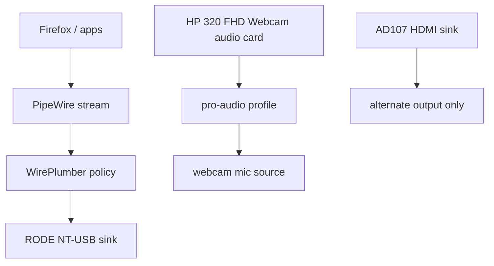

# PipeWire device restore drift, USB path failure, and stream pinning

## Context

This was not one bug. It was three different failures stacked on top of each other, which is exactly why the first half of the debugging felt fake.

The surface explanation was “PipeWire randomly died” or “Plasma reset my sound settings”.

That was wrong.

## Goal

- switch cleanly between HDMI output and my RODE NT-USB headphones
- keep Firefox following the output I actually selected
- expose the HP 320 FHD webcam mic as an input device
- recover from breakage without rebooting blind

## Environment

- Fedora workstation
- KDE Plasma desktop audio controls
- PipeWire audio server with WirePlumber session policy
- Firefox as a live playback stream that did not always follow sink changes
- RODE NT-USB headphones as the preferred output device
- HP 320 FHD webcam mic as the desired input source
- AD107 HDMI audio as an alternate output path

## The Actual Problem

The real failure was split across three layers:

1. **USB device path failure**  
   The RODE NT-USB was visible on USB, but on the bad path it was not consistently becoming a usable ALSA/PipeWire audio device. That made the output disappear entirely and sent me chasing routing problems before the device layer was even healthy.

2. **Session / restore drift**  
   WirePlumber was restoring defaults and targets into a bad graph state. At one point the graph came back with only an idle output and stale defaults still pointing at HDMI.

3. **Live stream pinning**  
   Even after the correct default sink came back, Firefox kept its existing live stream attached to HDMI. Changing the default sink did not move the already-running stream.

4. **Webcam mic profile was off**  
   The webcam audio card existed, but its active profile was `off`, so no mic source was created until I forced `pro-audio`.

## The Final State

The working shape is simple now:

- RODE NT-USB connected on a direct-good USB path
- RODE used as the active sink for playback
- Firefox stream explicitly moved to the RODE sink when needed
- HP 320 FHD Webcam set to `pro-audio` so the input source exists
- HDMI kept as a separate output target, not the assumed default



## What Changed

### Before

- RODE could disappear as an audio device on the bad USB path
    
- WirePlumber could come back with a broken graph and stale HDMI defaults
    
- Firefox stayed pinned to HDMI even after the default sink changed
    
- webcam mic was invisible because its card profile was `off`
    

### After

- RODE is on the known-good USB path
    
- RODE sink exists and is selected as the intended output
    
- live streams can be moved explicitly when they refuse to follow the default
    
- webcam card is forced to `pro-audio` when I want the mic source exposed

## Why This Version Is Better

- it separates **device failure** from **routing failure**
    
- it stops treating KDE UI as the source of truth
    
- it makes the recovery path explicit
    
- it avoids pretending “default sink changed” means “all apps moved”
    

## Mistakes I made

### 1. Debugging the wrong layer

I spent too long in Plasma settings when the real truth was in:

- `wpctl status`
    
- `pactl list short sinks`
    
- `pactl list short sources`
    
- `pactl list short sink-inputs`
    
- kernel USB errors
    

The UI was downstream noise.

### 2. Treating “audio” as one problem

Playback routing, mic visibility, and USB enumeration are not the same problem.

- output device selection is a sink problem
    
- browser playback sticking to the wrong output is a stream problem
    
- missing mic is a source/profile problem
    
- disappearing USB audio is a device path / kernel / ALSA problem
    

### 3. Touching `Pro Audio` blindly

`Pro Audio` was not a universal “make it work” button. On the webcam it was the only usable input profile. On other devices it was just an easy way to make the graph harder to reason about.

## Design rules

1. Do not trust Plasma audio menus as the primary diagnostic interface.
    
2. Check device existence before debugging routing.
    
3. A changed default sink does not guarantee existing app streams move.
    
4. USB audio devices should be tested on a direct-good port before blaming PipeWire.
    
5. If a source is missing, inspect the card profile before assuming the hardware is gone.
    

## Verification

These commands are the operational proof for the note:

- the RODE sink exists as a real PipeWire/ALSA audio device
- the webcam mic source exists when the card profile is correct
- live streams can be inspected and moved explicitly
- the USB topology can be correlated with the audio graph

### Fast truth check

```bash
wpctl status
pactl info
pactl list short sinks
pactl list short sources
pactl list short sink-inputs
aplay -l
arecord -l
lsusb -t
```

### Move a live app stream to the RODE sink

```bash
id=$(pactl list short sink-inputs | awk 'NR==1{print $1}')
pactl move-sink-input "$id" alsa_output.usb-RODE_Microphones_RODE_NT-USB-00.analog-stereo
```

### Re-enable webcam mic

```bash
pactl list cards short
pactl set-card-profile <webcam-card-id> pro-audio
pactl list short sources
```

### Capture a bad-state snapshot

```bash
mkdir -p ~/audio-debug
ts=$(date +%F-%H%M%S)
{
  echo '=== lsusb -t ==='
  lsusb -t
  echo
  echo '=== aplay -l ==='
  aplay -l
  echo
  echo '=== arecord -l ==='
  arecord -l
  echo
  echo '=== wpctl status ==='
  wpctl status
  echo
  echo '=== pactl info ==='
  pactl info
  echo
  echo '=== pactl sinks ==='
  pactl list short sinks
  echo
  echo '=== pactl sources ==='
  pactl list short sources
  echo
  echo '=== pactl sink-inputs ==='
  pactl list short sink-inputs
  echo
  echo '=== wireplumber log tail ==='
  journalctl --user -u wireplumber -b --no-pager | tail -120
  echo
  echo '=== kernel audio / usb tail ==='
  journalctl -k -b --no-pager | grep -Ei 'usb|snd|audio|pipewire|wireplumber'
} > ~/audio-debug/$ts.txt
```

## Failure Modes Worth Caring About

- RODE appears in USB but not as an ALSA/PipeWire audio card
    
- WirePlumber restores stale HDMI defaults into a half-broken graph
    
- app streams stay pinned to removed or undesired sinks
    
- webcam card stays on `off` and silently hides the mic
    
- partial restarts leave sockets active and respawn the same broken state
    

## What still does not exist

- a one-command local audio incident snapshot
    
- a one-command clean audio reset that stops sockets and clears state
    
- a note on which USB path for the RODE is known-good vs known-bad
    
- a policy decision on whether WirePlumber restore-target behavior should stay enabled

## Next steps

- write a tiny local `reset-audio` helper that stops sockets, kills processes, and restarts cleanly
- test whether disabling WirePlumber restore-target/default-target behavior reduces recurrence
- note the exact USB port / path that is stable for the RODE
- decide whether the webcam mic should be permanently default or only enabled when needed

## Honest conclusion

The bad part was not “Linux audio is random”.

The bad part was that I mixed together:

- a flaky USB audio path
- WirePlumber restore/state weirdness
- app stream pinning
- a webcam card left on `off`

Once those were separated, the fixes were boring:

- put the RODE on a good USB path
- move the live Firefox stream to the actual sink
- force the webcam card to `pro-audio`

That is a much less mystical problem than the UI made it look.
